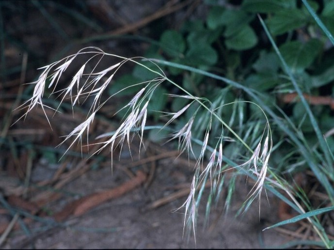
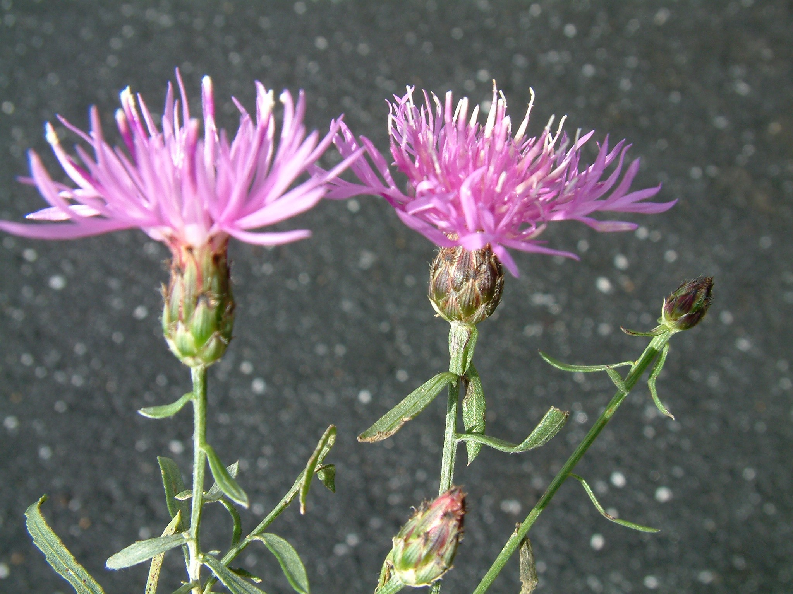

# Invasive Species Tracker

An AI-powered system for detecting and monitoring invasive plant species using Google Earth Engine satellite imagery and Claude AI analysis.

🌐 **[View Yellowstone National Park Analysis Report](https://adamanz.github.io/invasive-species-tracker/yellowstone_invasive_species_detailed)**

## 🚨 Yellowstone Report Key Findings (2019-2024)

- **275% increase** in invasive species hotspots (12→45 sites)
- **95.2% invasion probability** in fire-affected areas - highest ever recorded
- **$2.5-3.5 million** annual ecosystem damage if left unchecked
- **AI detected invasion signals 6-12 months early** - revolutionary early warning system
- **8 of 10 monitoring sites** now harbor multiple invasive species simultaneously

## Features

- 🛰️ Satellite imagery analysis using Google Earth Engine
- 🤖 AI-powered change detection with Claude Opus
- 📊 Vegetation index calculations (NDVI, EVI, NDWI)
- 🗺️ Interactive mapping and visualization
- 📈 Temporal analysis and trend detection
- 📄 Automated report generation

## Quick Start

### Prerequisites

- Python 3.9 or higher
- Google Cloud account with Earth Engine API enabled
- Anthropic API key for Claude

### Installation

1. **Clone the repository**
```bash
git clone https://github.com/yourusername/invasive-species-tracker.git
cd invasive-species-tracker
```

2. **Create a virtual environment**
```bash
python -m venv venv

# On macOS/Linux:
source venv/bin/activate

# On Windows:
venv\Scripts\activate
```

3. **Install dependencies**
```bash
pip install -r requirements.txt
```

4. **Set up environment variables**
```bash
cp .env.template .env
```

Edit `.env` with your credentials:
- `GOOGLE_CLOUD_PROJECT`: Your Google Cloud project ID
- `GOOGLE_CLOUD_API_KEY`: Your Google Cloud API key with Earth Engine enabled
- `ANTHROPIC_API_KEY`: Your Claude API key

5. **Verify Earth Engine connection**
```bash
python -m src.gee.auth
```

## Project Structure

```
invasive-species-tracker/
├── src/
│   ├── gee/              # Earth Engine modules
│   ├── analysis/         # Claude AI analysis
│   ├── visualization/    # Mapping and charts
│   └── utils/           # Helper functions
├── data/
│   ├── aois/            # Areas of interest
│   └── species/         # Species signatures
├── outputs/             # Generated reports and maps
├── tests/               # Unit tests
└── logs/               # Application logs
```

## Usage

### Basic Example

```python
from src.gee.auth import initialize_earth_engine
from src.gee.imagery import get_sentinel2_composite
from src.analysis.detector import InvasiveSpeciesDetector

# Initialize Earth Engine
initialize_earth_engine()

# Define area of interest
aoi = {
    'type': 'Rectangle',
    'coordinates': [-122.5, 37.5, -122.0, 38.0]
}

# Create detector
detector = InvasiveSpeciesDetector()

# Run analysis
results = detector.analyze_area(
    aoi=aoi,
    start_date='2023-01-01',
    end_date='2023-12-31',
    species='japanese_knotweed'
)

# Generate report
report = detector.generate_report(results)
print(report)
```

### Command Line Interface (Coming Soon)

```bash
# Analyze a specific area
python -m invasive_tracker analyze --aoi path/to/area.geojson --species kudzu

# Monitor changes over time
python -m invasive_tracker monitor --aoi path/to/area.geojson --interval monthly

# Generate report
python -m invasive_tracker report --results path/to/results.json
```

## Configuration

See `claude.md` for detailed project specifications and configuration options.

## Development

### Running Tests
```bash
pytest tests/
```

### Code Formatting
```bash
black src/
flake8 src/
```

### Type Checking
```bash
mypy src/
```

## Troubleshooting

### Earth Engine Authentication Issues

If you encounter authentication errors:

1. Ensure your Google Cloud API key has Earth Engine API enabled
2. Check that your project ID is correct
3. Verify API key permissions in Google Cloud Console

### Memory Issues with Large Areas

For large area analysis:
- Use smaller time windows
- Increase the `tileScale` parameter
- Export results to Google Cloud Storage

## Contributing

1. Fork the repository
2. Create a feature branch (`git checkout -b feature/amazing-feature`)
3. Commit your changes (`git commit -m 'Add amazing feature'`)
4. Push to the branch (`git push origin feature/amazing-feature`)
5. Open a Pull Request

## License

This project is licensed under the MIT License - see the LICENSE file for details.

## Target Species Detection

This system is designed to detect and monitor key invasive plant species across different ecosystems:

### 🌾 **Cheatgrass** (*Bromus tectorum*)



**Key Features:** Annual grass with drooping seed heads, rapidly colonizes post-fire areas
**Habitat:** Dry slopes, disturbed areas, creating significant fire risk

### 💜 **Spotted Knapweed** (*Centaurea stoebe*)



**Key Features:** Pink-purple flowers with distinctive black-spotted bracts
**Habitat:** Grasslands, open forests, allelopathic effects on natives

*For complete species identification guide, see [Yellowstone Analysis Report](outputs/reports/yellowstone_invasive_species_detailed.md)*

## Acknowledgments

- Google Earth Engine for satellite data access
- Anthropic for Claude AI capabilities
- California Invasive Plant Council (Cal-IPC) for species identification images
- The geospatial Python community