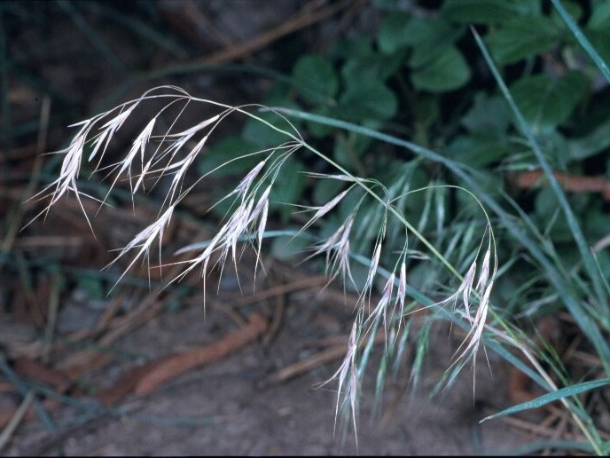

# Invasive Species Tracker - Project Specifications

## Project Overview
This project uses Google Earth Engine (GEE) and Claude AI to detect and track changes in invasive plant species over time. The system analyzes satellite imagery to identify potential invasive species spread patterns and generates AI-powered insights and reports.

## Architecture

### Core Components
- **Satellite Data Pipeline**: Google Earth Engine for accessing and processing satellite imagery
- **Change Detection Engine**: Analyzes temporal changes in vegetation indices
- **AI Analysis Module**: Claude Python SDK for intelligent pattern recognition and reporting
- **Visualization Layer**: Interactive maps and temporal analysis charts

### Technology Stack
- Python 3.9+
- Google Earth Engine Python API
- Claude Python SDK (anthropic)
- geemap for visualization
- pandas, numpy for data processing
- rasterio for geospatial data handling

## Google Earth Engine Configuration

### Authentication
- Use OAuth authentication (not API key or service account)
- Project must be registered at https://code.earthengine.google.com/register
- Store project ID in `.env` file (never commit)
- Initialize with: `ee.Authenticate()` then `ee.Initialize(project='your-project-id')`
- For headless/production: Use service account after initial OAuth setup

### Satellite Data Sources

#### Best Datasets for Invasive Species Detection:

1. **Sentinel-2 MSI Level-2A** (Primary - High Resolution)
   - Collection: `COPERNICUS/S2_SR_HARMONIZED`
   - Resolution: 10m (visible/NIR), 20m (red edge), 60m (atmospheric)
   - Revisit: 5 days
   - Best for: Current monitoring, species identification
   - Key bands: B2-B8A, B11-B12 for vegetation analysis
   - Advantages: High spatial resolution, frequent revisits, red edge bands

2. **Landsat 8/9 Collection 2** (Historical Analysis)
   - Collections: `LANDSAT/LC08/C02/T1_L2`, `LANDSAT/LC09/C02/T1_L2`
   - Resolution: 30m
   - Revisit: 16 days (8 days combined)
   - Best for: Long-term trend analysis (2013-present)
   - Key bands: B2-B7 for vegetation indices

3. **Planet Fusion Monitoring** (Ultra-High Resolution)
   - Collection: `PLANET/FUSION_SR` (requires Planet API access)
   - Resolution: 3m daily
   - Best for: Rapid spread detection, small infestations
   - Note: Requires additional Planet subscription

4. **MODIS Vegetation Products** (Large Scale Monitoring)
   - Collection: `MODIS/061/MOD13Q1` (16-day NDVI/EVI)
   - Resolution: 250m
   - Best for: Regional spread patterns, phenology tracking

5. **Sentinel-1 SAR** (All-Weather Monitoring)
   - Collection: `COPERNICUS/S1_GRD`
   - Resolution: 10m
   - Best for: Wetland invasives, structural changes
   - Advantages: Penetrates clouds, detects moisture

### AI-Driven Spectral Analysis (No Traditional Indices)

Instead of using traditional vegetation indices, we leverage Claude's pattern recognition:

1. **Direct Spectral Analysis**
   - Feed raw band values (B2-B12) to Claude
   - Let Claude identify species-specific spectral signatures
   - No information loss from index calculations

2. **Multi-temporal Pattern Recognition**
   - Provide time series of spectral data
   - Claude identifies phenological patterns unique to invasives
   - Detects sudden changes in spectral behavior

3. **Contextual Analysis Features**
   - Neighboring pixel relationships
   - Elevation and slope data
   - Climate and precipitation patterns
   - Historical land use

4. **Claude Analysis Prompts**
   ```python
   # Example prompt structure
   prompt = f"""
   Analyze this spectral signature for invasive species:
   - Location: {lat}, {lon}
   - Date: {acquisition_date}
   - Spectral bands (B2-B12): {band_values}
   - Temporal change: {previous_values} -> {current_values}
   - Surrounding area: {context_data}
   
   Identify any patterns consistent with invasive species spread.
   """
   ```

## Claude Integration

### API Configuration
```python
from anthropic import Anthropic
client = Anthropic(api_key=os.getenv("ANTHROPIC_API_KEY"))

# Use Claude Opus model for all analysis
MODEL = "claude-opus-4-20250514"
```

### Analysis Workflows
1. **Change Detection Reports**
   - Input: Time series of vegetation indices
   - Output: Natural language summary of changes
   - Prompt template: "Analyze these vegetation changes and identify potential invasive species spread patterns..."

2. **Species Identification**
   - Input: Spectral signatures + location data
   - Output: Likely species identification with confidence scores

3. **Management Recommendations**
   - Input: Spread patterns + environmental data
   - Output: Actionable management strategies

## Development Guidelines

### Code Standards
- Use type hints for all functions
- Follow PEP 8 style guide
- Document all GEE operations with comments
- Use 2-space indentation for consistency

### File Organization
```
invasive-species-tracker/
├── src/
│   ├── gee/              # Earth Engine modules
│   ├── analysis/         # Claude AI analysis
│   ├── visualization/    # Mapping and charts
│   └── utils/           # Helper functions
├── data/
│   ├── aois/            # Areas of interest (GeoJSON)
│   └── species/         # Species spectral signatures
├── outputs/
│   ├── reports/         # AI-generated reports
│   └── maps/            # Exported visualizations
└── tests/               # Unit and integration tests
```

### Environment Variables
```bash
GOOGLE_CLOUD_PROJECT=your-project-id
ANTHROPIC_API_KEY=your-claude-api-key
GEE_SERVICE_ACCOUNT=your-service-account@project.iam.gserviceaccount.com
```

## Target Invasive Species

### Primary Detection Targets

The system is configured to detect these high-priority invasive species using AI-driven spectral analysis:

#### 🌾 **Cheatgrass** (*Bromus tectorum*)

- **Spectral Signature**: Distinctive post-fire colonization pattern
- **Detection Window**: May-July (drying phase creates unique signature)
- **Fire Risk**: Critical - increases wildfire intensity by 300-400%

#### 💜 **Spotted Knapweed** (*Centaurea stoebe*)

- **Spectral Signature**: Allelopathic compounds affect surrounding vegetation
- **Detection Window**: July-September (flowering stage)
- **Impact**: Creates bare soil patches, reduces biodiversity

*For complete species identification guide, see outputs/reports/yellowstone_invasive_species_detailed.md*

## Invasive Species Detection Methodology

### Temporal Analysis
- **Baseline Period**: Establish normal vegetation patterns (1-2 years)
- **Detection Window**: Monthly or bi-weekly analysis
- **Change Threshold**: >20% change in vegetation indices

### Species-Specific Signatures
- **Japanese Knotweed**: High NIR reflectance, distinctive seasonal pattern
- **Purple Loosestrife**: Peak NDVI in July-August, wetland proximity
- **Kudzu**: Rapid expansion rate, overwrites native canopy signatures

### AI-Enhanced Detection
1. **Pattern Recognition**: Use Claude to identify unusual growth patterns
2. **Contextual Analysis**: Consider environmental factors (precipitation, temperature)
3. **False Positive Reduction**: Cross-reference with known land use changes

## Common Workflows

### 1. New Area Analysis
```python
# Define area of interest
aoi = ee.Geometry.Rectangle([lon_min, lat_min, lon_max, lat_max])

# Get cloud-free composite
composite = get_cloud_free_composite(aoi, start_date, end_date)

# Calculate vegetation indices
indices = calculate_vegetation_indices(composite)

# Run change detection
changes = detect_temporal_changes(indices, baseline_indices)

# Generate AI report using Claude Opus
report = generate_claude_report(changes, aoi_metadata, model=MODEL)
```

### 2. Species Monitoring
```python
# Load species signature
signature = load_species_signature('japanese_knotweed')

# Run spectral matching
matches = spectral_angle_mapper(composite, signature)

# Validate with Claude Opus
validation = validate_detection_with_claude(matches, field_data, model=MODEL)
```

## Testing Strategy

### Unit Tests
- Test all GEE operations with mock data
- Validate vegetation index calculations
- Test Claude API error handling

### Integration Tests
- End-to-end workflow testing
- API rate limit handling
- Large area processing performance

## Performance Optimization

### GEE Best Practices
- Use `ee.batch` for large exports
- Implement pyramid policy for visualization
- Cache frequently accessed datasets
- Limit spatial resolution based on analysis needs

### Claude API Optimization
- Batch similar analysis requests
- Implement response caching for repeated queries
- Use streaming for long reports

## Error Handling

### GEE Errors
- Handle quota exceeded errors with exponential backoff
- Validate geometries before processing
- Check band availability for each sensor

### Claude API Errors
- Implement retry logic for rate limits
- Fallback to basic analysis if API unavailable
- Log all API interactions for debugging

## Security Considerations
- Never commit API keys or credentials
- Use environment variables for all sensitive data
- Implement user authentication for web interface
- Validate all user inputs before GEE operations

## Future Enhancements
- Real-time alert system for rapid spread detection
- Mobile app for field validation
- Integration with citizen science platforms
- Machine learning model training on Claude outputs