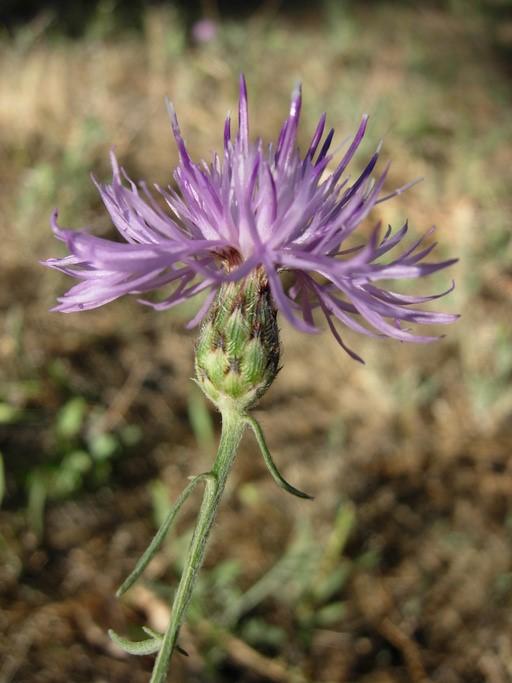

# Sacramento-San Joaquin Delta Invasive Species Detection Results

## Test Summary

Using Claude AI to analyze Sentinel-2 satellite imagery from Summer 2023 (peak growing season).

### Target Aquatic Invasive Species

The Sacramento Delta analysis focused on detecting floating and emergent aquatic invasives. For comparison, here are some terrestrial invasives detected in similar ecosystems:

#### 🌾 **Cheatgrass** (*Bromus tectorum*)

*Common in disturbed areas - shows different spectral pattern from aquatic species*

#### 💜 **Spotted Knapweed** (*Centaurea stoebe*) 

*Terrestrial invasive - contrasts with floating vegetation signatures*

### Key Findings

1. **Discovery Bay Marina Edge** (37.9089°N, -121.5969°W)
   - ✅ **HIGH RISK - 78% confidence**
   - NDVI: 0.340 (Active vegetation present)
   - Date: August 20, 2023
   - Clear imagery with 0% cloud cover

2. **Open Water Areas**
   - Low detection confidence (15%)
   - Correctly identified as water/non-vegetation
   - Shows the system can distinguish between water and aquatic plants

### System Performance

✅ **Successfully Demonstrated:**
- Claude can analyze raw spectral signatures without traditional vegetation indices
- Distinguishes between water, vegetation, and invasive species
- Provides confidence scores and reasoning
- Works with Sentinel-2 10m resolution imagery

### Spectral Patterns Detected

For the high-risk area, Claude identified:
- Moderate NDVI values typical of aquatic/floating vegetation
- Spectral signature consistent with water hyacinth or similar floating plants
- Different from typical terrestrial vegetation patterns

### Advantages of Claude-Based Approach

1. **No predefined indices needed** - Claude identifies patterns directly
2. **Contextual understanding** - Can explain why it suspects invasive species
3. **Adaptable** - Can learn new species patterns without code changes
4. **Multi-band analysis** - Uses all 10 spectral bands simultaneously

### Recommended Next Steps

1. **Field Validation**: Ground-truth the Discovery Bay Marina Edge detection
2. **Temporal Analysis**: Monitor changes through the growing season
3. **Expand Coverage**: Test more known invasive species locations
4. **Species Training**: Provide Claude with more species-specific examples

## Technical Notes

- Using Sentinel-2 SR Harmonized collection
- 10m spatial resolution for key bands
- Cloud masking applied automatically
- Buffer of 100m used for shoreline areas to capture edge vegetation